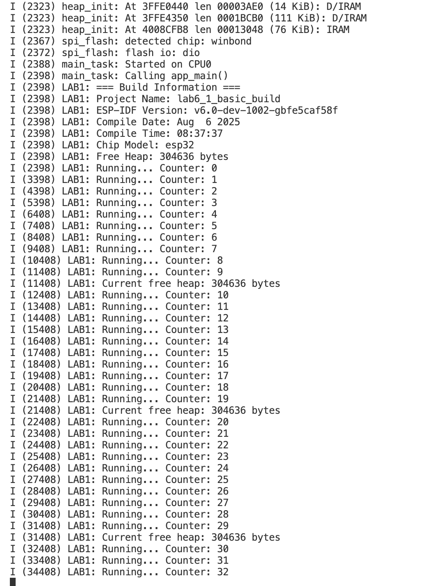

ภาพการทดลองเพิ่มเติม LAB6-1

## 🔍 คำถามทบทวน LAB6-1
1. **Docker vs Native Setup**: อธิบายข้อดีของการใช้ Docker เปรียบเทียบกับการติดตั้ง ESP-IDF บน host system
การใช้ Docker ทำให้ได้สภาพแวดล้อม ESP-IDF ที่พร้อมใช้งานทันที เสถียร เหมือนกันทุกเครื่อง ลดปัญหา dependency และสลับเวอร์ชันได้ง่าย ส่วน Native Setup เข้าถึงฮาร์ดแวร์สะดวกและรันเร็วกว่า แต่ติดตั้งและดูแลระบบยากกว่า และเสี่ยงเจอปัญหา dependency conflict
2. **Build Process**: อธิบายขั้นตอนการ build ของ ESP-IDF ใน Docker container ตั้งแต่ source code จนได้ binary
การ build ของ ESP-IDF ใน container มีขั้นตอนหลัก ๆ ดังนี้
Source code: โค้ดโครงการและไฟล์ CMakeLists.txt อยู่ในโฟลเดอร์โปรเจ็กต์ (mounted เข้า container)
idf.py build: คำสั่งนี้จะเรียก CMake เพื่อ generate build system (เช่น Ninja หรือ Make)
โหลด component ทั้งหมด (ทั้งของโครงการและของ ESP-IDF core)
Compile: ninja หรือ make จะ compile source .c/.cpp → object files .o
Linking: รวม object files และ library ต่าง ๆ เป็น binary firmware .elf
Convert: ใช้ esptool.py แปลง .elf → .bin สำหรับ flash ลง ESP32
Output: ไฟล์ .bin จะอยู่ในโฟลเดอร์ build/ ใน host และ container (เพราะแชร์ volume กัน)
3. **CMake Files**: บทบาทของไฟล์ CMakeLists.txt แต่ละไฟล์คืออะไร และทำงานอย่างไรใน Docker environment?
โฟลเดอร์โปรเจ็กต์หลัก:
ระบุชื่อโปรเจ็กต์ (project(name))
รวม component หลักที่จะ build
โฟลเดอร์ component (เช่น main/):
ใช้ idf_component_register(SRCS ... INCLUDE_DIRS ...)
บอกว่า component นี้มีไฟล์อะไรและ include path อะไรบ้าง
4. **Git Ignore**: ไฟล์ .gitignore มีความสำคัญอย่างไรสำหรับ ESP32 project development?
กันไม่ให้ไฟล์ที่ไม่จำเป็น (เช่น binary, build cache, config ส่วนตัว) เข้า git repo
ไฟล์ที่ควร ignore เช่น
/build/ → ไฟล์ binary, object, temporary จากการ build
sdkconfig (ถ้าใช้ส่วนตัว) หรือใช้ sdkconfig.defaults แทน
ไฟล์ log เช่น *.log
ข้อดีคือทำให้ repo สะอาด ขนาดเล็ก และ clone ได้เร็ว
5. **Container Persistence**: ข้อมูลใดบ้างที่จะหายไปเมื่อ restart container และข้อมูลใดที่จะอยู่ต่อ?
ไฟล์โค้ดและ build ที่อยู่ใน volume mapping (เช่น /project mapping ไป host) เพราะจริง ๆ แล้วอยู่บน hostจะอยู่ต่อ
ส่วนไฟล์/โฟลเดอร์ที่อยู่ใน container เท่านั้น (ไม่ได้อยู่ใน volume) เช่น ไฟล์ที่สร้างใน /tmp หรือ home ของ container
การติดตั้ง package ใน container ที่ไม่ได้ commit เป็น image ใหม่จะหายไป
6. **Development Workflow**: เปรียบเทียบ workflow การพัฒนาระหว่างการใช้ Docker กับการทำงานบน native system
Docker เหมาะสำหรับทีมและ environment ที่ต้องการความเหมือนกัน
Native เร็วกว่าเล็กน้อยและเข้าถึง hardware ตรง ๆ ง่ายกว่า แต่ต้องระวัง dependency conflict

## 🔍 คำถามทบทวนLAB6-2

1. **Multiple Source Files**: เหตุใดต้องแยก source code เป็นหลายไฟล์?
แยกโค้ดเป็นหลายไฟล์ทำให้โครงสร้างชัดเจน แก้ไขง่าย และดูแลได้สะดวก ไม่ต้องไล่โค้ดยาวในไฟล์เดียว
2. **CMakeLists.txt Management**: การเพิ่มไฟล์ source ใหม่ต้องแก้ไขอะไรบ้าง?
เมื่อเพิ่มไฟล์ .c ใหม่ ต้องเพิ่มชื่อไฟล์ใน SRCS ของ idf_component_register() เพื่อให้ CMake รู้ว่าต้อง compile ด้วย
3. **Header Files**: บทบาทของไฟล์ .h คืออะไร และทำไมต้องมี?
ใช้ประกาศฟังก์ชัน ตัวแปร และโครงสร้างข้อมูล เพื่อให้ไฟล์อื่นสามารถเรียกใช้งานได้ ช่วยแยกส่วนประกาศออกจากการ implement
4. **Include Directories**: เหตุใด CMakeLists.txt ต้องระบุ INCLUDE_DIRS?
ระบุโฟลเดอร์ที่มีไฟล์ .h เพื่อให้คอมไพเลอร์หาพบตอน include ป้องกัน error ว่าไม่เจอไฟล์ header
5. **Git Ignore**: ไฟล์ .gitignore ช่วยอะไรในการจัดการ ESP32 project?
ช่วยกันไม่ให้ไฟล์ที่ไม่จำเป็น เช่น build/ หรือไฟล์ชั่วคราว เข้าสู่ Git repo ทำให้โค้ดสะอาดและขนาดเล็ก
6. **Task Management**: การใช้ FreeRTOS task ในโมดูล LED ช่วยอะไร?
แยกงาน LED ออกเป็น task ทำให้รันควบคู่กับงานอื่นได้แบบ multitasking ไม่รบกวนกัน
7. **Code Organization**: ข้อดีของการแยกโมดูล sensor, display, led เป็นไฟล์แยกคืออะไร?
การแยก sensor, display, led เป็นไฟล์แยกทำให้แต่ละส่วนแก้ไขได้อิสระ ทดสอบง่าย และนำกลับมาใช้ซ้ำในโปรเจ็กต์อื่นได้

## 💡 บันทึกผลการทดลอง

**ขั้นตอนที่ 1 (เฉพาะ sensor.c):**
- จำนวนไฟล์ source: 2
- ขนาด binary:  163673 bytes
- การทำงาน: อ่านข้อมูลจาก sensor โดยแสดงอุณหภูมิและความชื้นบน console พร้อมแสดงสถานะของ sensor ทุก 3 รอบ

**ขั้นตอนที่ 2 (เพิ่ม display.c):**
- จำนวนไฟล์ source: source: 3
- ขนาด binary: 163981 bytes
- การทำงาน: เพิ่มการแสดงผล display_init(), display_show_message() และ display_show_data() เพื่อแสดงค่า

**ขั้นตอนที่ 3 (เพิ่ม led.c):**
- จำนวนไฟล์ source: source: 4
- ขนาด binary: 164773 bytes
- การทำงาน: เพิ่มการทำงานของ LED โดยรัน task ให้ LED กะพริบทุก 3 วินาที และแสดงสถานะ LED  ทุกรอบ 

**สังเกต:**
- การเพิ่มไฟล์ source ส่งผลต่อขนาด binary อย่างไร?
ขนาด binary จะเพิ่มขึ้นทุกครั้งที่เพิ่มไฟล์ source ใหม่ เพราะมีโค้ด ฟังก์ชัน และข้อมูลที่ต้อง compile เพิ่ม ทำให้ไฟล์ .bin มีขนาดใหญ่ขึ้นตามลำดับ
- LED กะพริบทุกกี่วินาที?
จากการตั้งค่าใน led.c LED กะพริบทุก 3 วินาที ตามรอบของ task
- แต่ละโมดูลแสดงข้อมูล file และ line อย่างไร?
แต่ละโมดูลใช้ฟังก์ชัน printf หรือ logging ของ ESP-IDF พร้อมแมโคร __FILE__ และ __LINE__ เพื่อบอกชื่อไฟล์และหมายเลขบรรทัด